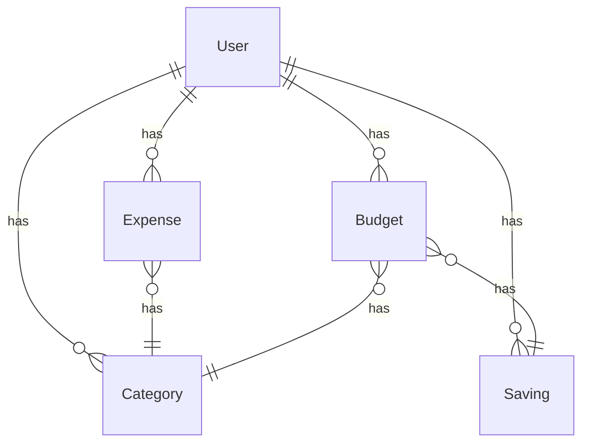

# CashManager

A simple app to manage your physical cash.

## Characteristics

- Manage your physical cash (total)
- Manage your day to day expenses
- Delimite a budget for each day
- See your expenses history
- See how much you have saved per day

## Technologies

- Node.js
- Vue.js
- Flask
- PostgreSQL

## How to install

The project have two parts: the backend and the frontend. You need to install both.

### Frontend

- Go to the `frontend` folder

- Run the **following commands**:
  
  ```
  npm install
  ```
  
  You should now have a `node_modules` folder in the `frontend` folder.
  
  ```
  npm run serve
  ```
  
  This will start the frontend server on `localhost:8080`.

### Backend

- Go to the `backend` folder

- Create a virtual environment:
  
  ```
  python -m venv venv
  ```

- Activate the **virtual environment**:
  In case you are using Windows:
  
  ```
  venv\Scripts\activate
  ```
  
  In case you are using Linux or Mac:
  
  ```
  source venv/bin/activate
  ```

- Once you are in the virtual environment, **install the requirements**:
  
  ```
  pip install -r requirements.txt
  ```

- Then **set the app folder** as the main folder:
  In case you are using Windows:
  
  ```
  set FLASK_APP=app/
  ```
  
  or in case you are using Linux or Mac:
  
  ```
  export FLASK_APP=app/
  ```

- Finally, **run the app**:
  
  ```
  flask run
  ```
  
  This will start the backend server on `localhost:5000`.

## Backend API

### Models:

The models will be used to create the database tables. This are some rules that the models must follow:

- An User is identified by an username and have a password. 
- An User can have many Expenses. An expense is identified by an id and haves a value, a date, a category and a description.
- An User can configure a Budget per day. A budget is identified by an id, a value and a date. A budget can be repeated weekly, monthly, or not repeated at all.
- An User have a Saving per day. A saving is identified by an id, a value and a date. It will increment every day if the user have a budget configured and if the user have expenses less than the budget.
- An User can create many Categories that are only available for that user. A category is identified by an id and a name.
- An expense can have many categories. A category can be used by one or many expenses.
- A budget is only active between the start date and the end date. If the end date is not set, the budget will be active until the user deletes it.
- A budget cannot conflict with another budget. If the user tries to create a budget that conflicts with another budget, the new budget will not be created. The user will be notified about the conflict and will be able to delete the old budget or change the dates of the new budget.
- If a day does not have a budget configured, the saving will be 0 for that day. Also if the user have expenses greater than the budget, the saving will be negative.

Following this rules, the models are:

diagrama:


